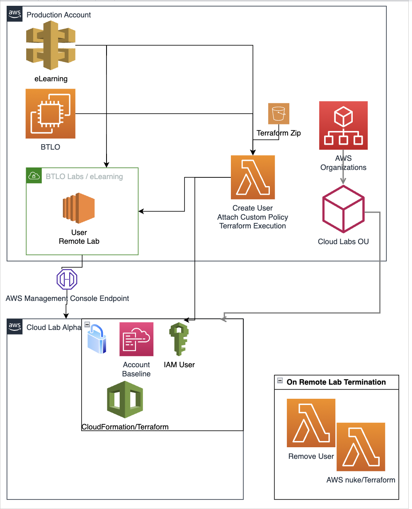

# sbt_cloud_lab
### Creating SBT Cloud Labs on AWS

### Architecture

## Terraform & Boto3 Power!

- Running terraform scripts on other AWS account using boto3.
- create a user on the target AWS account where terraform resources will be created.
- Pass the AWS access and secret key by creating a  provider.tf inside lambda.
- Upload terraform scripts to s3 bucket.

## SBT User Flow

- launch lab that will trigger a lambda function that will create a sandbox AWS account for SBT users.
- Create terraform user and sbt user in the sandbox AWS account with the necessary permission.

- Execute terraform scripts on sandbox account.

- Install AWS Nuke using terraform that will clean the lab created by user request.

- Destroy AWS nuke environment using terraform state file.

## Lower lambda function for running terraform scripts
- Upload terraform scripts to s3 bucket after running **terraform init** locally on your machine, so lambda does not need to download the provider files.
- Terraform installation using subprocess and wrapper.

## Note
- Check Terraform folder for terraform scripts that create a lab, aws nuke and destroying aws nuke.
